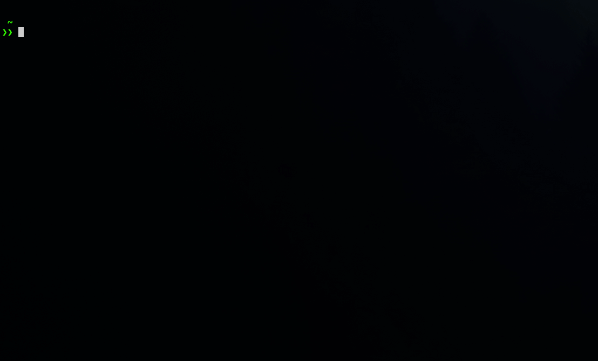

# ♟ chessview

**A fast PGN viewer for your terminal.**

Browse a file full of games, pick one, and step through it move by move — right in the terminal.

[](https://github.com/cazeth/chessview/actions/workflows/ci.yml)
[](LICENSE.md)
[](Cargo.toml)
[](https://ratatui.rs)



## Features

- **Multi-game files.** Open a PGN with many games and pick from a menu; a single-game file jumps straight to the board.
- **Step through any game.** Walk forwards and backwards, jump to the start or the final position, and see the last move highlighted.
- **Real-image pieces (optional).** With the `images` feature, pieces render as real graphics on terminals that support Sixel, Kitty, or iTerm2 — with a graceful half-block fallback. Without it, crisp block sprites are used everywhere.
- **Mouse and keyboard.** Click a game to open it, click the on-screen controls to navigate, or drive everything from the keyboard.

## Install

From source (Rust **1.85+**):

```sh
cargo install --git https://github.com/cazeth/chessview
```

Or clone and build:

```sh
git clone https://github.com/cazeth/chessview
cd chessview
cargo install --path .
```

For real-image pieces, enable the feature (needs Rust **1.86+** and a graphics-capable terminal):

```sh
cargo install --path . --features images
```

> **Tip:** prefer a shorter command? Add a binary alias to `Cargo.toml` and you can invoke it as `cv`:
> ```toml
> [[bin]]
> name = "cv"
> path = "src/main.rs"
> ```

## Usage

Point it at a PGN file:

```sh
chessview game.pgn
```

With no argument, chessview reads the single PGN file in its data directory (`<data-dir>/chessview/`).

### Keys

**Menu**

| Key | Action |
| --- | --- |
| `↑` / `↓` | Move the selection |
| `Home` / `End` | Jump to the first / last game |
| `Enter` | Open the selected game |
| `q` / `Esc` | Quit |

**Board**

| Key | Action |
| --- | --- |
| `←` / `→` | Previous / next move |
| `r` / `Home` | Reset to the starting position |
| `End` | Jump to the final position |
| `a` / `Esc` | Back to the game list |
| `q` | Quit |

The move list, the game list, and the on-screen buttons are all clickable too.

## Development

```sh
cargo test                 # run the test suite
cargo test --all-features  # include the image-rendering tests
cargo clippy --all-targets --all-features -- -D warnings
cargo fmt --all
```

The minimum supported Rust version is **1.85** (the `images` feature needs 1.86). MSRV is enforced in CI, and `Cargo.toml` uses `resolver = "3"` so dependency selection stays compatible with it. CI runs the suite on Linux, macOS, and Windows.

## License

The source code is licensed under the [MIT License](LICENSE.md).

The chess piece images in [`assets/`](assets/) are the "cburnett" set by Colin M.L. Burnett, used under the 3-Clause BSD License — see [`assets/CREDITS.md`](assets/CREDITS.md) and [`assets/LICENSE.md`](assets/LICENSE.md).

## Acknowledgements

- Built with [Ratatui](https://ratatui.rs) for the terminal UI.
- Piece artwork by [Colin M.L. Burnett](https://en.wikipedia.org/wiki/User:Cburnett/GFDL_images/Chess) (the "cburnett" set), by way of the [lichess](https://github.com/lichess-org/lila) project.
